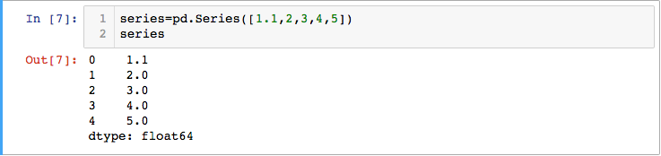
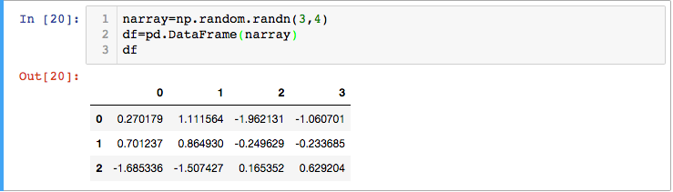
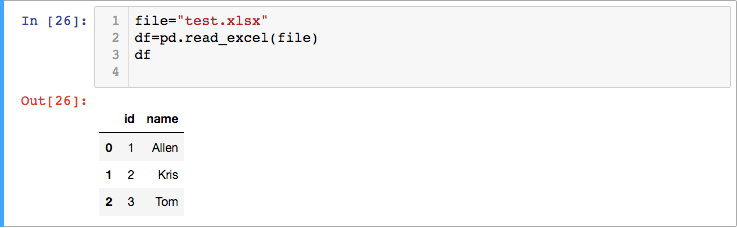
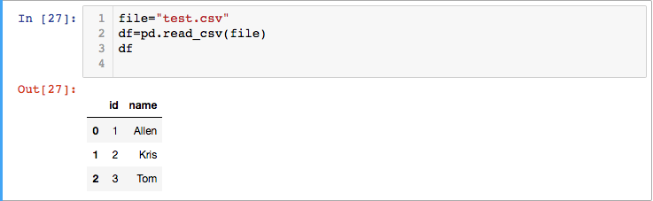
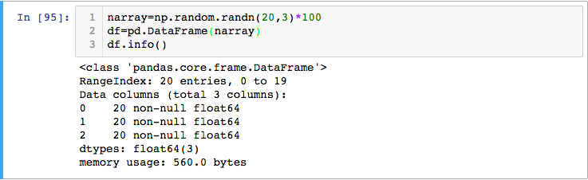
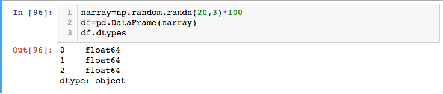
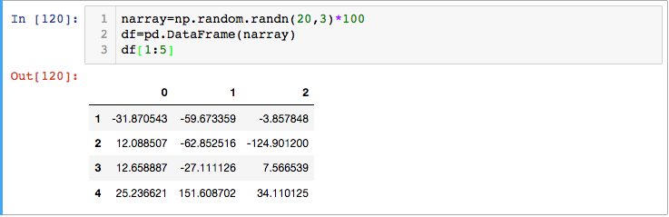

[toc]

# 什么是pandas

pandas是一个Python的开源、BSD授权的库，提供了高性能、易用的数据结构与数据分析工具。

[官方网站](http://pandas.pydata.org/)，详细内容请参照[官方文档](http://pandas.pydata.org/pandas-docs/stable/pandas.pdf)。

# 为什么要用pandas来处理数据：

- 清晰：以二维表的形式组织数据，非常直观，一目了然。
- 方便：简单的构造和组织方法，可以随意对行或列进行切分。
- 高效：基于numpy库写成的许多数据处理方法，性能保证。
- 全面：封装有缺失值处理、分类变量编码等实用的方法。


# 常用方法

常用的引入方式：

```
import pandas as pd
```

## 构造Series和DataFrame

### Series

Series（序列）是一个pandas中的常见对象，它可以视作二维表中的一列数据。它具备列名（name）和数据行数（count），以及索引（index）这三个基本属性。

Series构造时传入一个List即可。同时，它会根据List中元素的类型，自动对Series的元素类型进行设定。

例如，如果传入的List都是整形元素，则Series的元素类型也都是整形。


如果传入的List包含浮点型元素，则Series的元素类型也都是浮点型。



而若List中的元素类型不一致，有数值型有字符串型，则Series的元素会采用object类型。


给Series命名：


获得Series的数据行数：


修改Series的索引为时间类型索引：


### DataFrame

DataFrame本质上是多个Series的组合，因此它也具备列名、数据行数和索引这三个属性，只不过这里的列名是一个pandas中的对象RangeIndex，表示一个包含所有Series的列名的列表。

直接传入numpy array类型的源数据

  

读取excel文件

  
  
读取csv

  


## 操作DataFrame

### 查看数据

- 看头几行数据head(n)


- 看末尾几行数据tail(n)


- 查看统计量describe()

超级强大的一个方法，可以立刻获得对应所有列的数据行数、均值、标准差、最小值、4分位值与最大值。


- 查看索引、数据行数与数据列值类型info()



- 查看各数据列值类型dtypes



### 排序

- 通过一个轴（axis）来对数据进行排序

**注意在pandas里面，横轴为axis=1，纵轴为axis=0(原因可以参考我的这篇博客[深度学习框架Keras学习系列（一）：线性代数基础与numpy使用（Linear Algebra Basis and Numpy）](http://blog.csdn.net/qq_32690999/article/details/78590750#%E4%B8%BA%E4%BB%80%E4%B9%88%E7%94%A8numpy))。**

  - 对索引（纵轴）排序：sort_index(axis=0)

  

  - 对列（横轴）排序sort_index(axis=1)

  

- 以某个列的值为依据进行整体数据排序sort_values()


### 切分数据

- 获得单独某列数据.['列名']（等价于df.列名）


- 获得指定索引(指定行数)数据.[start_index:end_index]（切片）



当索引是时间类型时，也可以以字符串形式的日期范围来指定数据


