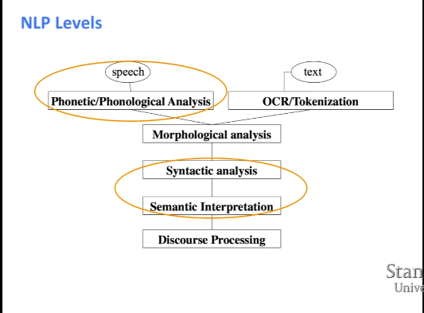
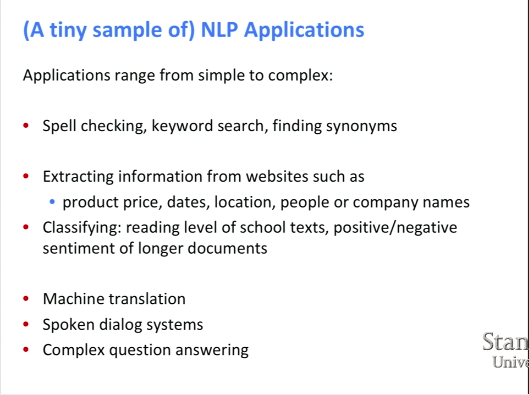
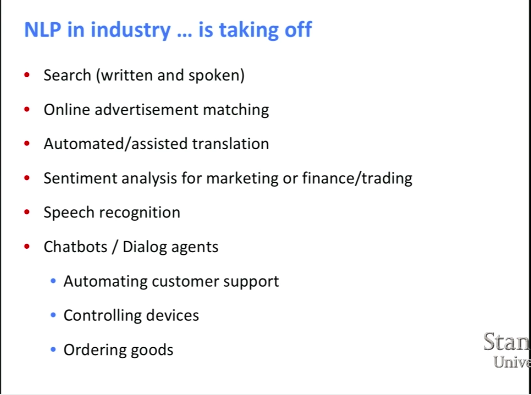
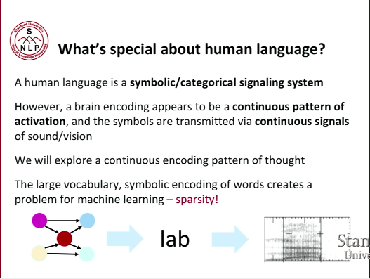

[Link for Lecture 1](https://www.youtube.com/watch?v=OQQ-W_63UgQ&list=PL3FW7Lu3i5Jsnh1rnUwq_TcylNr7EkRe6&index=1&t=1602s)

[toc]

# Lecture Plan

# What is Natural Language Processing (NLP)?

Goal: for computers to process or "understand" natural language in order to perform tasks that are useful.

Human being's most distinctive feature is its natural language.

- NLP levels

The most important parts that this course is going to focus on is circled out above.

- NLP Applications

- What's special about human language

**Symbolic encoding of words creates a [Sparsity Problem]!!!**

# What's Deep Learning (DL)?

A subfield of machine learning.

