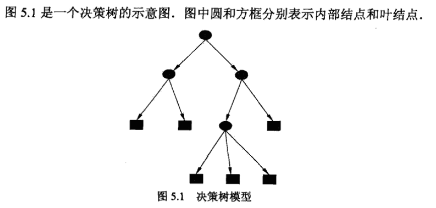

决策树是机器学习算法中比较经典的一类算法，它最大的特点是具备很好的可解释性，因为它的整体拟合思路是：通过一定方法找到最合适的分类属性，一层层地将不同类的样本划分开。因此，在训练好一个性能不错的决策树后，我们可以简单地将决策树模型的分类标准可视化，进而了解到最能影响到样例所属类别，或者说最有助于判断样例所属类别的属性是哪些。

[toc]

# 决策树模型

决策树由结点（node）和有向边（directed edge）组成。结点有两种类型：内部结点（internal node）和叶结点（leaf node）。内部结点表示一个特征或属性，叶节点表示一个类。

用决策树分类，从根节点开始，对实例的某一特征进行测试，根据测试结果，将实例分配到子结点：这时，每一个子结点对应着该特征的一个取值。如此递归地对实例进行测试并分配，直至到达叶结点。最后将实例分配到叶结点的类中。

*图来自李航《统计学习方法》第5章*

# 划分属性的标准

直觉上来说，我们一般判断一个事物的分类，也是根据该事物最显著的特征来判断，如果显著的特征都很难让我们做决断，那就只能看更多细节的特征了。

比如说，我们判断一个人的性别，那么一般看一下是长头发还是短头发，嗓音是粗是细，身材是高大还是娇小，基本上就能八九不离十地确定了。可是如果一个女孩子天生身材高大一点，嗓子粗了一点，也喜欢留短发，那怎么办？于是我们可能需要看她的着装，比如是否穿裙子等等。

而决策树在选择一层层地分类依据时，也是有类似的思路：当有非常显著，显著到足够轻易区分出某个类别的样例的属性时，这种属性一般都会用于决策树自身作为“最优先”的判断标准，而当这些属性的取值比较模糊，无法将某个样例归类到某个叶结点时，那就只能用不那么显著的特征来作为接下来继续判断的标准。

那么问题来了，我们怎么**量化一个特征是否够显著**呢？

## 属性选择标准：信息增益 (information gain) -> ID3

信息增益就是一个非常好的，可以衡量特征显著性的一个标准。但在学习信息增益的定义前，我们还必须先了解另一个概念：**熵（Entropy）**。

### 熵（Entropy）

这里的熵的概念来自于信息论，是香农最早从物理学中借用并扩展的一个术语。它表示的是**随机变量不确定性的度量**。

具体来说，假设X是一个取有限个值的离散随机变量，其概率分布为：

$$P(X=x_i)=p_i,\ i=1,2,...,n$$

则随机变量X的熵定义为：

$$H(X)=-\Sigma^n_{i=1}p_ilogp_i$$

在上式中，若$p_i=0$，则定义$0log0=0$。通常式中的对数以2为底或以e为底（自然对数），这时熵的单位分别称作比特（bit）或纳特（nat）。由此定义可知，熵的大小只依赖于X的分布，而与X的具体取值无关，所以也可将X的熵记作H(p)：

$$H(p)=-\Sigma^n_{i=1}p_ilogp_i$$

而熵越大，随机变量的不确定性就越大。从定义可验证：

$$0\le H(p) \le logn$$

### 条件熵（conditional entropy）

条件熵顾名思义，是给定条件下的熵。

假设有随机变量（X，Y），其联合概率分布为：

$$P(X=x_i,Y=y_j)=P_{ij},\ i=1,2,...,n;\ j=1,2,...,m$$

条件熵H(Y|X)表示在已知随机变量X的条件下，随机变量Y的不确定性。其定义为X给定条件下，Y的条件概率分布的熵对X的数学期望：

$$H(Y|X)=\Sigma^n_{i=1}p_iH(Y|X=x_i)$$

这里，$p_i=P(X=x_i),\ i=1,2,...,n.$

而当熵和条件熵中的概率由数据估计（特别是极大似然估计）得到时，所对应的熵与条件熵分别称为经验熵（empirical entropy）和经验条件熵（empirical conditional entropy）。

关于【极大似然估计】的知识，可以参看以下回答：

>[如何通俗地理解概率论中的「极大似然估计法」? - 马同学的回答 - 知乎](https://www.zhihu.com/question/24124998/answer/242682386)

### 信息增益 (information gain)

这时，我们终于来到最核心的信息增益的定义：**得知特征X的信息而使得类Y的信息的不确定性减少的程度**。

具体来说，假设特征A对训练数据集D的信息增益g(D,A)，其定义为集合D的经验熵H(D)与特征A给定条件下D的经验条件熵H(D|A)之差，即：

$$g(D,A)=H(D)-H(D|A)$$

一般地，熵H(Y)与条件熵H(Y|X)之差称为互信息（mutual information）。决策树学习中的信息增益等价于训练数据集中类与特征的互信息。

对于一个数据集D而言，信息增益依赖于特征，不同的特征往往具有不同的信息增益，信息增益大的特征具有更强的分类能力，即我们前面提到的“更显著”的特征。

而根据信息增益准则的特征选择方法是：对训练数据集D（或子集），计算其每个特征的信息增益，并比较它们的大小，选择信息增益最大的特征。

### 信息增益的算法

输入：训练数据集D和特征A；
输出：特征A对训练数据集D的信息增益g(D,A)。

（1）计算数据集D的经验熵H(D)：

$$H(D)=-\Sigma^K_{k=1}\frac{|C_k|}{|D|}log_2\frac{|C_k|}{|D|}$$

（2）计算特征A对数据及D的经验条件熵H(D|A)：

$$H(D|A)=\Sigma^n_{i=1}\frac{|D_i|}{|D|}H(D_i)=-\Sigma^n_{i=1}\frac{|D_i|}{|D|}\Sigma^K_{k=1}\frac{|D_{ik}|}{|D_i|}log_2\frac{|D_{ik}|}{|D_i|}$$

（3）计算信息增益：

$$g(D,A)=H(D)-H(D|A)$$

### 基于信息增益的决策树生成: ID3算法

那么，知道了信息增益的计算方法，我们也就可以开始正式地去生成一个可以实际有用的决策树模型了。

ID3算法的核心是在决策树各个结点上应用信息增益准则选择特征，递归地构建决策树。具体方法是：从根节点开始，对结点计算所有可能的特征信息增益，选择信息增益最大的特征作为结点的特征，由该特征的不同取值建立子结点；再对子结点递归地调用以上方法，构建决策树；直到所有特征的信息增益均很小或没有特征可以选择为止。最后得到一个决策树。ID3相当于用极大似然法进行概率模型的选择。

- 算法描述

输入：训练数据集D，特征集A，阈值$\epsilon$;
输出：决策树T。

（1）若D中所有实例属于同一类$C_k$，则T为单结点树，并将类$C_k$作为该结点的类标记，返回T；

（2）若A=$\emptyset$，则T为单结点树，并将D中实例数最大的类$C_k$作为该结点的类标记，返回T;

（3）否则，按照信息增益的算法计算A中各特征对D的信息增益，选择信息增益最大的特征$A_g$；

（4）如果$A_g$的信息增益小于阈值$\epsilon$，则置T为单结点树，并将D中实例数最大的类$C_k$作为该结点的类标记，返回T；

（5）否则，对$A_g$的每一个可能值$a_i$，依$A_g=a_i$将D分割为若干非空子集$D_i$，将$D_i$中实例数最大的类作为标记，构建子结点，由结点及其子结点构成树T，返回T；

（6）对第i个子结点，以$D_i$为训练集，以A-{$A_i$}为特征集，递归地调用步骤(1)~步骤(5)，得到子树$T_i$，返回$T_i$。

## 属性选择标准：信息增益比 (information gain ratio) -> C4.5

上一部分，我们了解了作为一种属性选择标准的信息增益的概念及算法，那信息增益比又是个什么东西呢？

之所以要提出信息增益比的概念，是因为信息增益作为属性选择标准时，存在一个缺陷：它使得ID3算法会偏向于优先选择取值个数较多的特征。

我们知道，一个特征取值越多，它的熵一般越大，那么当该属性作为划分标准时，它能够消除的信息不确定性的能力也就越强，信息增益也就越大。而信息增益比就对这一问题进行了校正。

- 定义

特征A对训练数据集D的信息增益比$g_R(D,A)$定义为其薪资增益g(D,A)与训练数据集D关于特征A的值的熵$H_A(D)$之比，即：

$$g_R(D,A)=\frac{g(D,A)}{H_A(D)}$$

其中，$H_A(D)=-\Sigma^n_{i=1}\frac{|D_i|}{D}log_2\frac{D_i}{D}$，n是特征A取值的个数。

而基于信息增益比来选择特征的决策树生成算法就是**C4.5算法**，它和ID3同为最经典的两个决策树算法。

# 防止过拟合的方法：剪枝 (pruning)

# CART

## 分类树的属性选择标准：基尼系数

## 回归树的属性选择标准：均方误差

# GBDT

# Ensemble一下

## 随机森林

## Kaggle神器：XGBoost

> 横扫Kaggle大赛的XGBoost（2016年的29个获奖方案中，有17个是用XGBoost)。 ——[XGBoost与深度学习到底孰优孰劣？都说XGBoost好用，为什么名气总不如深度学习？](http://news.hiapk.com/internet/s5937472b6b7b.html)

XGBoost是“极度梯度提升”的简称，而术语“梯度提升”是Friedman在论文《Greedy Function Approximation: A Gradient Boosting Machin》中首次提出的，XGBoost便基于这个原始模型。

XGBoost is short for “Extreme Gradient Boosting”, where the term “Gradient Boosting” is proposed in the paper Greedy Function Approximation: A Gradient Boosting Machine, by Friedman. XGBoost is based on this original model. This is a tutorial on gradient boosted trees, and most of the content is based on these slides by the author of xgboost.

The GBM (boosted trees) has been around for really a while, and there are a lot of materials on the topic. This tutorial tries to explain boosted trees in a self-contained and principled way using the elements of supervised learning. We think this explanation is cleaner, more formal, and motivates the variant used in xgboost.

***

我是bluemapleman(tomqianmaple@outlook.com)，一个致力于用人工智能普惠世界的有志者。

资料参考：
[1][Introduction to Boosted Trees](https://xgboost.readthedocs.io/en/latest/model.html)

[2]《统计学习方法》——李航（2012年3月第1版）
