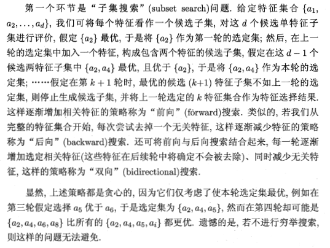

本博客是针对周志华教授所著《机器学习》的“第11章 特征选择与稀疏学习”部分内容的学习笔记。

***

在实际使用机器学习算法的过程中，往往在特征选择这一块是一个比较让人模棱两可的问题，有时候可能不知道如果想要让当前的模型效果更好，到底是应该加还是减掉一些特征，加又是加哪些，减又是减哪些，所以借着对这一章内容的学习，希望可以在文末解决这个疑惑。

[toc]

# 子集搜索与评价

对一个学习任务来说，给定属性集，其中有些属性可能很关键、很有用，另一些属性则可能没什么用，我们将属性称为“特征”（feature），对当前学习任务有用的属性称为“相关特征”（relevant feature）、没什么用的属性称为“无关特征”（irrelevant feature）。从给定的特征集合中选择出相关特征子集的过程，称为“特征选择”（feature selection）。

特征选择是一个重要的“数据预处理”（data preprocessing）过程，**在现实机器学习任务中，获得数据之后通常先进行特征选择，此后再训练学习器，那么，为什么要进行特征选择呢？**

- 首先，我们在现实任务中经常会遇到**维数灾难**问题，这是由于属性过多造成的。若能从中选择出重要的特征，则能缓解该问题。（这个意义上来说，特征选择与降维有相似的动机。链接[对维数灾难的理解](http://blog.csdn.net/zbc1090549839/article/details/38929215)）
- 去除不相关特征往往会降低学习任务的难度。

特征选择过程还要确保不丢失重要特征，否则后续学习过程会因为重要信息的缺失而无法获得好的性能。并且给定同一个数据集，若学习任务不同，则相关特征很可能不同，因此，特征选择中所谓的“无关特征”是**指与当前学习任务无关**。

还有一类特征称为“冗余特征”（redundant feature），它们所包含的信息能从其它特征中推演出来。例如，对于一个立方体，若已有特征“底面长”“底面宽”，则“底面积”是冗余特征，因为它从用已有特征得到。冗余特征很多时候不起作用，去除它们会减轻学习过程的负担。不过有时候冗余特征也可以降低学习任务的难度，因为它可能恰好对应了完成学习任务所需的“中间概念”。比如说，如果学习目标是估算立方体的体积，则“底面积”这个冗余特征的存在将使得体积的估算更容易。

为简化讨论，本章暂且假定数据中不涉及冗余特征，并且假定初始的特征集合中包含了所有的重要信息。

而如果要从初始的特征集合中选取一个包含了所有重要信息的特征子集，**若没有任何领域知识作为先验假设**（领域知识可以简化特征选择过程），那就只好遍历所有可能的子集了；然而这在计算上不太可行，因为会遭遇组合爆炸，特征个数稍多就无法进行。可行的做法是产生一个“候选子集”，评价出它的好坏，基于评价结果产生下一个候选子集，再对其进行评价，......，这个过程持续进行下去，直至无法找到更好的候选子集为止。显然，这里涉及两个关键问题：

- 如何根据评价结果获取下一个候选特征子集？
- 如何评价候选特征子集的好坏？

## 子集搜索（subset search）

- 贪心策略：前向搜索、后向搜索与双向搜索

因此，在非遍历所有子集的要求下，子集搜索方法必然只能是贪心的。

## 子集评价（subset evaluation）

给定数据集D，假定D中第i类样本所占的比例为$p_i(i=1,2,...,|y|)$。为便于讨论，假定样本属性均为离散型。对属性子集A，假定根据其取值将D分成了V个子集${D^1,D^2,...,D^V}$，每个子集中的样本在A上取值相同，于是我们可计算属性子集A的信息增益：
$$Gain(A)=Ent(D)-\Sigma^V_{v=1}\frac{|D^v|}{D}Ent(D^v)，$$其公式其实就是数据集D的信息熵，减去按照属性A切分出来的所有数据集的加权信息熵的差值。其中信息熵衡量的是信息的混乱/模糊程度。其公式定义为：
$$Ent(D)=-\Sigma^{|y|}_{i=1}p_klog_2p_k，$$
信息增益Gain（A）越大（信息混乱程度在D集合按照属性A切分后减少得很多），意味着特征子集A包含的有助于分类的信息越多。于是，对每个候选特征子集，我们课基于训练数据集D来计算其信息增益，以此作为评价准则。

更一般的，特征子集A实际上确定了对数据集D的一个划分，每个划分区域对应着A上的一个取值，而样本标记信息Y则对应着对D的真实划分，通过估算对这两个划分的差异，就能对A进行评价。与Y对应的划分的差异越小，则说明A越好。不过信息熵也仅是判断这个差异的一种标准，其它能判断两个划分差异的机制都能用于特征子集评价，包括但不限于许多“多样性度量”如不合度量、相关系数。

**将特征子集搜索机制与子集评价机制相结合，即可得到特征选择方法**。例如将前向搜索与信息熵相结合，这显然与决策树算法非常相似。事实上，决策树可用于特征选择，树结点的划分属性所组成的集合就是选择出的特征子集。其它的特征选择方法未必像决策树特征选择这么明显，但它们在本质上都是**显式或隐式地结合了某种（或多种）子集搜索机制和子集评价机制**。

常见的特征选择方法可分为三类：过滤式（filter）、包裹式（wrapper）和嵌入式（embedding）。

# 过滤式选择

过滤式方法先对数据集进行特征选择，然后再训练学习器，特征选择过程与后续学习器无关。这相当于先用特征选择过程对初始特征进行“过滤”，再用过滤后的特征来训练模型，故得名“过滤式选择”。

Relief(Relevant Features) 是一种注明的过滤式特征选择方法，该方法设计了一个”相关统计量
来度量特征的重要性，该统计量是一个向量，其每个分量分别对应于一个初始特征，而特征子集的重要性则是由子集中每个特征所对应的相关统计量分量之和来决定。于是，最终只需指定一个阈值$\tau$，然后选择比$\tau$大的统计量分量所对应的特征即可；也可指定与选取的特征个数k，然后选择相关统计量分量最大的k个特征。

Relief的关键就在于如何确定相关统计量。（这里不详述具体做法，有兴趣的同学可以看原书。）

但Relief是为二分类问题设计的，其扩展变体Relief-F能处理多分类问题。

# 包裹式选择

与过滤式特征选择不考虑后续学习器不同，**包裹式**特征选择直接把最终将要使用的学习器的性能作为特征子集的评价准则。换言之，包裹式特征选择的目的就是为给定学习器选择最有利于其性能、“量身定做”的特征子集。

一般而言，由于包裹式特征选择方法直接针对给定学习器进行优化，因此从最终学习器性能来看，包裹式特征选择比过滤式特征选择更好，但另一方面，由于在特征选择过程中需多次训练学习器，因此包裹式特征选择的计算开销通常比过滤式大得多。

LVW（Las Vegas Wrapper）是一个典型的包裹式特征选择方法。它在拉斯维加斯方法（Las Vegas Method）框架下使用随机策略来进行子集搜索，并以最终分类器的误差为特征子集评价准则，算法描述如下图所示：

(拉斯维加斯方法和蒙特卡洛方法时两个以著名赌城名字命名的随机化方法，两者的主要区别是：若有时间限制，则拉斯维加斯方法或者给出满足要求的解，或者不给出解，而蒙特卡洛方法一定会给出解，虽然给出的解未必满足要求；若无时间限制，则两者都能给出满足要求的解。)

# 嵌入式选择与L1正则化

在过滤式和包裹式特征选择方法中，特征选择过程与学习器训练过程有明显的分别（过滤式是先做特征选择，再用过滤后的特征做学习器训练，而包裹式是用学习器训练的结果作为特征选择的依据）；与此不同，嵌入式特征选择是将特征选择过程与学习器训练过程融为一体，两者在同一个优化过程中完成，即在学习器训练过程中自动地进行了特征选择。

比如给定数据集$D={(x_1,y_1),(x_2,y_2),...,(x_m,y_m)}$，其中$x\in R^d,y\in R$，我们考虑最简单的线性回归模型，以平方误差为损失函数，则优化目标为：

$$min_w \Sigma_{i-1}^m (y_i-w^Tx_i)^2.$$

当样本的特征非常多，而样本数相对比较少的时候，上式很容易陷入过拟合（也是维度灾难的体现，所谓high variance问题）。而为了缓解过拟合问题，我们可以对上式引入正则化项。若使用$L_2$范数正则化，则有：

$$min_w \Sigma_{i-1}^m (y_i-w^Tx_i)^2+\lambda||w||^2_2.$$

其中正则化参数$\lambda>0$。

上式也称为**“岭回归”（ridge regression）**，通过引入$L_2$范数正则化，确实能显著降低过拟合风险。

那么，能否将正则化项中的$L_2$范数替换为$L_p$范数呢？答案是肯定的，若令p=1，即采用$L_1$范数，则有：

$$min_w \Sigma_{i-1}^m (y_i-w^Tx_i)^2+\lambda||w||_1.$$

同样正则化参数$\lambda>0$，而上式被称为**LASSO（Least Absolute Shrinkage and Selection Operator），中文也称“最小绝对收缩选择算子”**。

$L_1$范数和$L_2$范数都有助于降低过拟合风险，但前者还会带来一个额外的好处：它比后者更易于获得“稀疏”（sparse）解，即它求得的w会有更少的非零分量（更多的零分量）。

> 事实上，对w施加“稀疏约束”（即希望w的非零分量尽可能少）最自然的是使用$L_0$范数，但$L_0$范数不连续，难以优化求解，因此常使用$L_1$范数来近似。关于$L_0,L_1,L_2$范数的知识，可以参考这里[机器学习中的范数规则化之（一）L0、L1与L2范数](http://blog.csdn.net/zouxy09/article/details/24971995)。

为了帮助理解，我们来看一个直观的例子：假定x仅有两个属性，于是无论岭回归还是LASSO接触的w都只有两个分量，即$w_1,w_2$，我们将其作为两个坐标轴，然后在图中绘制出两个式子的第一项的"等值线"，即在$(w_1,w_2)$空间中平方误差项取值相同的点的连线。再分别绘制出$L_1$范数和$L_2$范数的等值线，即在$(w_1,w_2)$空间中$L_1$范数取值相同的点的连线，以及$L_2$范数取值相同的点的连线（如下图所示）。

岭回归与LASSO的解都要在平方误差项与正则化项之间折中，即出现在图中平方误差项等值线与正则化项等值线相交处。而由上图可以看出，采用$L_1$范数时平方误差项等值线与正则化项等值线的交点常出现在坐标轴上，即$w_1或w_2$为0，而在采用$L_2$范数时，两者的交点常出现在某个象限中，即$w_1或w_2$均非0；换言之，采用$L_1$范数比$L_2$范数更易于得到稀疏解。

注意到w取得稀疏解意味着初始的d个特征中仅有对应着w的非零分量的特征才会出现在最终模型中，于是求解$L_1$范数正则化的结果时得到了仅采用一部分初始特征的模型；换言之，基于$L_1$正则化的学习方法就是一种嵌入式特征选择方法，其特征选择过程和学习器训练过程融为一体，同时完成。

