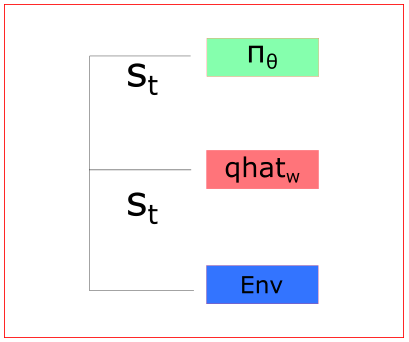
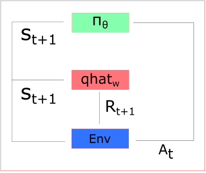
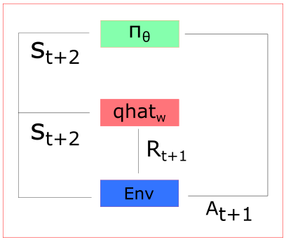

# 强化学习之从Q-Learning到A3C (Reinforcement learning: from Q learning to A3C)

```
作者：Bluemapleman(tomqianmaple@outlook.com)

Github：[https://github.com/bluemapleman](https://github.com/bluemapleman) (欢迎star和fork你喜欢的项目)

知识无价，写作辛苦，欢迎转载，但请注明出处，谢谢！
```

前言：强化学习常用的模型可以按照思路大体分为两类：Value Based和Policy Based。顾名思义，Value Based以学习评估某state下，对应各action的评分/期望回报/Q值，并根据指定策略来选择行动为主（间接），而Policy Based则以学习某state下，直接给出最好的action为主（直接）。而当两者结合，policy based的模型称为Actor（执行者），value based的模型称为Critic（评判者），开始互相促进学习时，也就有了当前效果最强的A3C。本文的目的就是简单地梳理一下这个发展的流程，以及总结各个类型的模型的训练方法，方便理解和参考。

[toc]

# Value based methods
# Policy based methods


# Actor Critic

Actor Critic模型一般在介绍完policy based模型后就会介绍，因为本质上来说，Actor Critic就是给policy based的模型找了个critic来帮助它更快地学习。

Policy based的方法Monte Carlo REINFORCE[1]方法有个问题就是必须在每个episode结束后，才能进行学习，这直觉上就会使得学习过程是缓慢的，并且不能针对具体每个动作进行学习，而是只能根据episode结束后的reward平均地认为之前的episode中的所有行为都是好的，或不好的。

而Actor Critic利用Critic能够根据直接针对episode中的每个step的state和action进行评估，使得**Actor具备了Temporal Difference Learning，即单步学习的能力**。这无疑是一个重大改进。

我们从公式上来进行说明：

- Policy Based更新方式：$$\Delta\theta=\alpha*\bigtriangledown_{\theta}*log(\pi(S_t,A_t,\theta))*R(t)$$

- Actor Critic中Actor更新方式：$$\Delta\theta=\alpha*\bigtriangledown_{\theta}*log(\pi(S_t,A_t,\theta))*Q(S_t,A_t)$$

而value based和policy based的方法里，我们最后都是用neural network来作为fucntion approximator的，所以Actor和Critic也就是两个不同的nn：

- Actor: controls the agent's action$$\pi(s,a,\theta)$$
- Critic: measures how good actions are$$\hat{q}(s,a,w)$$

这两个nn拥有各自的一套参数(Actor是$\theta$，Critic是w)。我们会让两个nn交替运行，同时训练它们，让它们找到各自最优的参数使得agent的reward最大。

## 学习/更新公式

把Actor和Critic的学习公式贴在一起：

- Actor: $$\Delta\theta=\alpha\bigtriangledown_\theta (log\pi_\theta(s,a))\hat{q}_w(s,a)\ \ (1)$$ 

- Critic: $$\Delta w=\beta(R(s_{t+1},a_{t+1})+\gamma\hat{q}_w(s_{t+1},a_{t+1})-\hat{q}_w(s_{t},a_{t}))\bigtriangledown_w\hat{q}_w(s_t,a_t)\ \ (2)$$

(1)式中的$\alpha$和(2)式中的$\beta$是Actor和Critic各自的学习率。

(1)式中的$\theta(s,a))\hat{q}_w(s,a)$是Critic对当前的state和action给出的评分；(2)式中的$\gamma\hat{q}_w(s_{t+1},a_{t+1})-\hat{q}_w(s_{t},a_{t}))$就是**TD error**，其形式就是Q Leanring中‘采取行动后获得的$Q(s_t,a_t)$的实际值，与理论的$Q(s_t,a_t)$的差值’，所以我们其实还是在用Q Learning的那一套方法在更新Critic。

## 具体过程

>下面的图来自参考[1]。

<center>

</center>
在step t时，agent从Environment获取当前state($s_t$)，把它分别feed给Actor和Critic的nn。

<center>

</center>
Actor接收state后，给出action并执行($a_t$)，agent从环境中获得下一个state($s_{t+1}$)和reward(r_{t+1}).

这之后，Critic根据$s_t,a_t$计算出$\hat{q}_w(s_t,a_t)$，即对早state下采取action的q值，Actor使用这个q值来更新它的参数: $$\Delta\theta=\alpha\bigtriangledown_\theta (log\pi_\theta(s_t,a_t))\hat{q}_w(s_t,a_t)$$ 

<center>

</center>
Actor完成一次参数更新后，再根据$s_{t+1}$采取action(a_{t+1})。

这之后，Critic更新一次它的参数：$$\Delta w=\beta(R(s_{t+1},a_{t+1})+\gamma\hat{q}_w(s_{t+1},a_{t+1})-\hat{q}_w(s_{t},a_{t}))\bigtriangledown_w\hat{q}_w(s_t,a_t)$$

重复以上过程，直到获得performance足够好的agent。

## A2C

### 引入Advantage function

文献[2]谈到过，value based method/Critic的一个缺陷是：高度的不稳定性(high variability）。

为了解决这个问题，我们用advantage function替代q learning中本来的value function。

定义advantage function：$$A(s,a)=Q(s,a)-V(s)$$。

Q(s,a)是我们对state s下采取action a的估值，而V(s)是综合考虑了处于state s下的平均估值（考虑s下可以采取的所有action），因此它们的差值反应了**s下采取a相对s平均情况下的优势**。换言之，advantage function衡量的是我能从s下的a中获得的额外回报。

于是，当A(s,a)>0时，梯度就会向使得s下采取a的估值更大的方向更新；反之会向使得s下采取a的估值更小的方向更新。

实现advantage function需要我们同时具备两个估值函数Q(s,a)和V(s)，而我们可以直接用TD error来替代advantage function：$$A(s,a)=Q(s,a)-V(s)$$，$$Q(s,a)=r+\gamma V(s')$$，$$A(s,a)=r+\gamma V(s')-V(s)=TD error$$


# 参考

[1] [An intro to Advantage Actor Critic methods: let’s play Sonic the Hedgehog!](https://medium.freecodecamp.org/an-intro-to-advantage-actor-critic-methods-lets-play-sonic-the-hedgehog-86d6240171d)

[2] [Improvements in Deep Q Learning: Dueling Double DQN, Prioritized Experience Replay, and fixed Q-targets
](https://medium.freecodecamp.org/improvements-in-deep-q-learning-dueling-double-dqn-prioritized-experience-replay-and-fixed-58b130cc5682)
