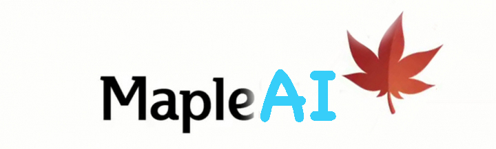

# MapleAI

人工智能（Artificial Intelligence）相关的学习资料。主要相关内容包括`深度学习`，`机器学习`，`强化学习`，`计算机视觉`与`自然语言处理`。

Applications and study materials for artificial intelligence. Contents mainly include `deep learning`, `machine learning`,`reinforcement learning`, `computer vision`, `natural language processing`.

# 个人整理资源/Resources

[EBook/电子书](https://github.com/bluemapleman/MapleAI/tree/master/EBooks)

[Moocs/网课](https://github.com/bluemapleman/MapleAI/tree/master/Moocs)

# 网络博文/Online Materials

## 深度学习/Deep Learning

### seq2seq

|topic|material|difficulty|
|-----|--------|----------|
|从seq2seq、attention到transformer|[从seq2seq、attention到transformer](https://zhuanlan.zhihu.com/p/54368798)|容易|

### 卷积神经网络/Convolutional Neural Network

|topic|material|difficulty|
|-----|--------|----------|
|Basic concepts|[Stanford cs231n Convolutional Neural Networks (CNNs / ConvNets)](http://cs231n.github.io/convolutional-networks/)|Medium|
|Utilize CNN in a simple way using Keras|[Building a Convolutional Neural Network (CNN) in Keras](https://towardsdatascience.com/building-a-convolutional-neural-network-cnn-in-keras-329fbbadc5f5)|easy|

### 对抗神经网络/Generative Adversarial Network

|topic|material|Illustration|
|-----|--------|----------|
|vanilla GAN's principles and implementation|[GANs from Scratch 1: A deep introduction. With code in PyTorch and TensorFlow](https://medium.com/ai-society/gans-from-scratch-1-a-deep-introduction-with-code-in-pytorch-and-tensorflow-cb03cdcdba0f)|Good for green hand|

## 自然语言处理/Natural Language Processing

### 预训练/Pre-training

|topic|material|difficulty|
|-----|--------|----------|
|Word Embedding/BERT|[从Word Embedding到Bert模型—自然语言处理中的预训练技术发展史](https://zhuanlan.zhihu.com/p/49271699?utm_source=qq&utm_medium=social&utm_oi=588247887557824512)|Easy|

## 强化学习/Reinforcement Learning

|topic|material|illustration|
|-----|--------|----------|
|Hand by hand tutorial on implementing RL algorithms|[Series: Simple Reinforcement Learning with Tensorflow](https://github.com/bluemapleman/MapleAI/tree/master/Blogs/ReinforcementLearning)（个人的[中文翻译版本](https://medium.com/emergent-future/simple-reinforcement-learning-with-tensorflow-part-0-q-learning-with-tables-and-neural-networks-d195264329d0))
|OpenAI's open-source projects on teaching principles and implementations of state-of-the-art RL models|[OpenAI-Spinning up](https://spinningup.openai.com/en/latest/user/introduction.html)||

# 有趣的领域进展

[诞生于2014年的围棋之神：AlphaGo](https://zh.wikipedia.org/zh-hans/AlphaGo)

